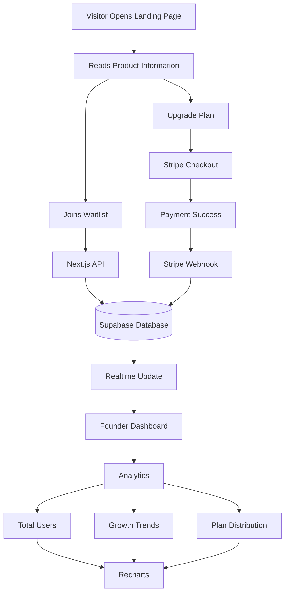

# 🚀 AI Meeting Notes — Founder Launch Kit

<p align="center">


</p>

<p align="center">
A production-ready SaaS launch template for modern founders featuring a premium landing page, real-time waitlist management, analytics dashboard, and Stripe integration.
</p>

---

# 🌐 Live Demo

**🔴 Live:** https://ai-meeting-notes1.vercel.app/

---

# 📖 Overview

AI Meeting Notes is a production-style SaaS starter built for founders who want to validate an idea before investing months into development.

Instead of building the entire product first, founders can launch a premium landing page, collect early users, monitor traction in real time, and even simulate paid subscriptions using Stripe Test Mode.

The project demonstrates how modern SaaS products are structured using Next.js App Router, Supabase, Stripe, Tailwind CSS, and Framer Motion.

---

# ✨ Features

* 🎨 Premium Landing Page
* 📧 Waitlist Email Collection
* ⚡ Real-time Supabase Database
* 📊 Analytics Dashboard
* 📈 Growth Charts (Recharts)
* 💳 Stripe Checkout (Test Mode)
* 🌙 Dark / Light Mode
* 📱 Fully Responsive
* ✨ Smooth Framer Motion Animations
* ⚙️ API Routes with Next.js
* 🚀 Production-style Architecture

---

# 🏗️ System Architecture

```text
                    User
                      │
                      ▼
             Landing Page (Next.js)
                      │
          Join Waitlist / Subscribe
                      │
                      ▼
               Next.js API Routes
                      │
          ┌───────────┴───────────┐
          ▼                       ▼
     Supabase DB             Stripe API
          │                       │
          │                 Stripe Webhook
          │                       │
          └──────────────┬────────┘
                         ▼
                 Founder Dashboard
                         │
          ┌──────────────┼──────────────┐
          ▼              ▼              ▼
     Total Users     Growth Chart   Plan Stats
```

---

# 🔄 Workflow



---

# 🧰 Tech Stack

| Category       | Technology              |
| -------------- | ----------------------- |
| Framework      | Next.js App Router      |
| Language       | TypeScript              |
| Styling        | Tailwind CSS            |
| UI Components  | shadcn/ui               |
| Database       | Supabase                |
| Authentication | Ready for Supabase Auth |
| Charts         | Recharts                |
| Payments       | Stripe                  |
| Animations     | Framer Motion           |
| Deployment     | Vercel                  |

---

# 📂 Project Structure

```text
ai-meeting-notes/

├── app/
│   ├── api/
│   ├── dashboard/
│   ├── globals.css
│   ├── page.tsx
│   └── layout.tsx
│
├── components/
│   ├── dashboard/
│   ├── landing/
│   ├── layout/
│   └── ui/
│
├── hooks/
│
├── lib/
│   ├── stripe.ts
│   ├── supabase.ts
│   └── utils.ts
│
├── public/
│
├── styles/
│
└── package.json
```

---

# ⚙️ How It Works

### Step 1

A visitor lands on the website and learns about the product.

↓

### Step 2

The visitor enters their email to join the waitlist.

↓

### Step 3

The email is submitted to a Next.js API Route.

↓

### Step 4

The API stores the data inside Supabase.

↓

### Step 5

Supabase updates the dashboard in real time.

↓

### Step 6

Founders can monitor:

* Total Waitlist Users
* Growth Trends
* Subscription Plans
* Overall Product Traction

↓

### Step 7

If a premium plan is selected, Stripe Checkout handles payment (Test Mode).

---

# 🎯 Design Decisions

## Why Next.js?

* Server Components
* App Router
* API Routes
* Excellent Vercel Integration
* SEO Friendly

---

## Why Supabase?

* PostgreSQL Database
* Realtime Features
* Easy API
* Scalable Backend
* No custom server required

---

## Why Stripe?

* Industry-standard payment gateway
* Reliable Checkout
* Easy testing
* Webhook support

---

## Why Recharts?

Initially D3.js was explored.

However,

* D3 required more boilerplate.
* Recharts integrates directly with React.
* Faster development.
* Easier maintenance.

---

## Why Framer Motion?

Originally CSS animations were implemented.

Framer Motion provided

* Better animation control
* Cleaner code
* More polished interactions
* Improved developer experience

---

# 🤖 AI-Assisted Development

AI was used as a productivity tool throughout development.

Examples include:

* Tailwind UI refinement
* Layout suggestions
* Mock analytics data generation
* Stripe debugging
* Component refactoring
* Documentation improvements

Architecture, implementation decisions, and business logic were designed and integrated manually.

---

# 🚀 Getting Started

## Clone Repository

```bash
git clone <your-repository-url>
```

```bash
cd ai-meeting-notes
```

---

## Install

```bash
npm install
```

---

## Run

```bash
npm run dev
```

Application:

```
http://localhost:3000
```

---

# 🔑 Environment Variables

Create a `.env.local`

```env
# Supabase

NEXT_PUBLIC_SUPABASE_URL=

NEXT_PUBLIC_SUPABASE_ANON_KEY=

# Stripe

STRIPE_SECRET_KEY=

NEXT_PUBLIC_STRIPE_PUBLISHABLE_KEY=

STRIPE_WEBHOOK_SECRET=
```

---

# 📊 Dashboard Metrics

The dashboard currently visualizes:

* Waitlist Count
* Growth Trend
* Subscription Distribution
* User Statistics
* Revenue Placeholder
* Activity Overview

---

# ⚠️ Known Limitations

* Stripe operates in Test Mode
* Authentication not implemented
* Limited form validation
* No email automation
* No admin panel
* Basic analytics only

---

# 🛣️ Future Improvements

* User Authentication
* Email Verification
* Welcome Emails
* Admin Dashboard
* Export CSV
* Advanced Analytics
* Funnel Tracking
* Cohort Analysis
* Stripe Billing Portal
* Team Accounts
* Role-based Access
* Unit Testing
* Integration Testing
* Performance Optimization
* Server-side Caching

---

# 📈 Use Cases

Perfect for:

* SaaS MVPs
* Startup Validation
* Founder Launches
* Investor Demos
* Portfolio Projects
* Full-stack Learning
* Product Experiments

---

---

# 🚀 Deployment

Deploy easily on **Vercel**

```bash
npm run build
```

Production-ready with:

* Vercel
* Supabase
* Stripe
* Environment Variables

---

# 🤝 Contributing

Contributions are welcome.

1. Fork the repository
2. Create a new branch
3. Commit your changes
4. Push the branch
5. Open a Pull Request

---

# 🛡️ License

MIT License

Feel free to use this project for learning, experimentation, or as a foundation for your own SaaS products.

---

# 💙 Acknowledgements

Built with

* Next.js
* Supabase
* Stripe
* Tailwind CSS
* Framer Motion
* Recharts
* TypeScript

---

# ⭐ Support

If you found this project useful:

⭐ Star the repository

🍴 Fork it

🚀 Build something amazing

---

# 💡 Final Note

This project demonstrates how modern SaaS products can be validated quickly using a waitlist-first approach.

Rather than building every feature upfront, founders can launch early, measure real user interest, and iterate based on data. The architecture emphasizes simplicity, scalability, and production-ready development practices while providing a polished user experience suitable for portfolios, startup demos, and MVP launches.
