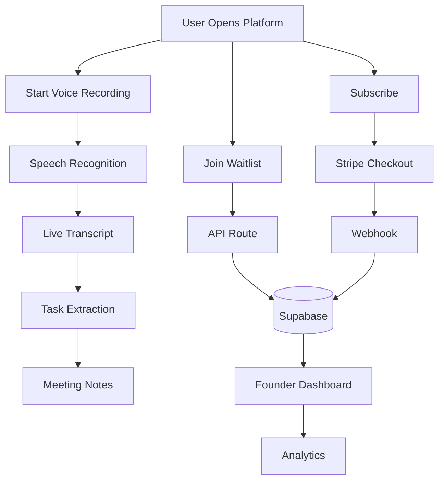

# 🚀 AI Meeting Notes

<p align="center">
  <h3 align="center">AI-Powered Meeting Intelligence Platform</h3>

  <p align="center">
    Real-time Voice Transcription • Smart Action Item Extraction • Founder Analytics • Referral Engine • Stripe Billing
  </p>

  <p align="center">
    <a href="https://ai-meeting-notes1.vercel.app/">🌐 Live Demo</a>
  </p>
</p>

---

<p align="center">
  
  
  
  
  
  
  
  
</p>

---

# 📖 Overview

AI Meeting Notes is a production-ready SaaS platform that combines **AI-powered meeting transcription**, **smart task extraction**, **subscription billing**, **founder analytics**, and a **viral waitlist system** into a modern full-stack application.

The platform enables founders to validate products quickly while allowing users to experience AI meeting assistance through a browser-based voice recorder without requiring external transcription services.

Built with modern technologies including **Next.js 15**, **React**, **TypeScript**, **Supabase**, **Stripe**, and **Tailwind CSS**, the application follows production-ready architecture and scalable development practices.

---

# ✨ Features

## 🎙️ AI Meeting Intelligence

- Real-time browser voice transcription
- Native Web Speech API integration
- Zero external transcription costs
- Automatic meeting note generation
- Live microphone recording

### Smart Action Item Extraction

Automatically detects actionable tasks from spoken conversations.

Examples:
- Need to...
- Have to...
- Make sure...
- Don't forget...

Tasks are converted into organized meeting checklists.

---

## 👥 Viral Waitlist & Referral Engine

- Personalized referral links
- Queue position tracking
- Referral leaderboard
- Live social proof notifications
- Waitlist analytics
- Growth monitoring

---

## 📊 Founder Analytics Dashboard

Comprehensive dashboard including:
- Total Users
- Waitlist Growth
- Subscription Distribution
- Referral Statistics
- Revenue Tracking
- User Management
- Interactive Charts
- KPI Cards

---

## 💳 Stripe Subscription System

- Stripe Checkout
- Webhook Integration
- Billing Portal
- Subscription Status
- Payment Success Handling
- Customer Billing Management

---

## 🔐 Security Features

- Honeypot Bot Protection
- Disposable Email Detection
- IP Rate Limiting
- Secure Authentication Flow
- Input Validation
- Protected API Routes

---

## 🎯 Demo Sandbox

A built-in demonstration mode allows anyone to explore the application instantly.

### Demo Workspace
- AI Meeting Recorder
- Voice Transcription
- Meeting Notes
- Action Items

### Founder Dashboard
- Analytics
- User Tables
- Charts
- Revenue Metrics
- Waitlist Management

---

# 🛠️ Tech Stack

| Category | Technology |
|-----------|------------|
| Framework | Next.js 15 (App Router) |
| Frontend | React 19 |
| Language | TypeScript |
| Styling | Tailwind CSS |
| UI Library | shadcn/ui |
| Database | Supabase |
| Authentication | Supabase Auth |
| Payments | Stripe |
| Charts | Recharts |
| Animation | Framer Motion |
| Deployment | Vercel |

---

# 🏗️ System Architecture

```text
                    User
                      │
                      ▼
         AI Meeting Notes Platform
                      │
          ┌───────────┴───────────┐
          ▼                       ▼
   Voice Recording          Join Waitlist
          │                       │
          ▼                       ▼
 Web Speech API          Next.js API Routes
          │                       │
          └───────────┬───────────┘
                      ▼
                 Supabase Database
                      │
          ┌───────────┴───────────┐
          ▼                       ▼
    Founder Dashboard        Stripe API
          │                       │
          └───────────┬───────────┘
                      ▼
              Analytics & Billing
```

---

# 🔄 Application Workflow



---

# 📂 Project Structure

```text
ai-meeting-notes/
├── app/
│   ├── api/
│   ├── dashboard/
│   ├── login/
│   ├── profile/
│   └── page.tsx
├── components/
│   ├── auth/
│   ├── dashboard/
│   ├── landing/
│   ├── layout/
│   └── ui/
├── hooks/
├── lib/
│   ├── stripe.ts
│   ├── supabase.ts
│   └── utils.ts
├── utils/
├── public/
└── package.json
```

---

# 🚀 Getting Started

## Clone Repository

```bash
git clone https://github.com/sauravsingh019/AI-Meeting-Notes.git
cd ai-meeting-notes
```

---

## Install Dependencies

```bash
npm install
```

---

## Configure Environment Variables

Create a `.env.local` file:

```env
# Supabase
NEXT_PUBLIC_SUPABASE_URL=
NEXT_PUBLIC_SUPABASE_ANON_KEY=
SUPABASE_SERVICE_ROLE_KEY=

# Stripe
STRIPE_SECRET_KEY=
NEXT_PUBLIC_STRIPE_PUBLISHABLE_KEY=
STRIPE_WEBHOOK_SECRET=

# Resend
RESEND_API_KEY=

# App
NEXT_PUBLIC_APP_URL=http://localhost:3000
```

---

## Run Development Server

```bash
npm run dev
```

Visit [http://localhost:3000](http://localhost:3000) to view the project.

---

# 📈 Dashboard Metrics

The Founder Dashboard provides insights into:
- Total Users
- Active Subscribers
- Waitlist Growth
- Referral Performance
- Revenue Statistics
- Subscription Distribution
- Recent Activity
- Conversion Metrics

---

# 🎨 Highlights

- Production-ready architecture
- AI-powered meeting transcription
- Smart action item generation
- Modern SaaS dashboard
- Stripe billing integration
- Real-time analytics
- Responsive UI
- Dark / Light mode
- Fully typed with TypeScript
- Scalable project structure
- Enterprise-grade UI components

---

# 🚀 Deployment

The project is optimized for deployment on **Vercel**.

```bash
npm run build
```

Configure the required environment variables in your deployment platform before publishing.

---

# 🛣️ Future Roadmap

- AI Meeting Summarization
- Multi-language Transcription
- Speaker Identification
- Calendar Integration
- Email Notifications
- Team Collaboration
- Role-Based Access Control
- CSV & PDF Export
- Advanced Analytics
- Meeting History Search
- AI Chat with Meeting Notes
- Unit & Integration Testing

---

# 🤝 Contributing

Contributions are welcome.

1. Fork the repository
2. Create a feature branch
3. Commit your changes
4. Push to your branch
5. Open a Pull Request

---

# 📄 License

This project is licensed under the **MIT License**.

---

# 🙌 Acknowledgements

Built using:
- Next.js
- React
- TypeScript
- Supabase
- Stripe
- Tailwind CSS
- shadcn/ui
- Framer Motion
- Recharts

---

# ⭐ Support

If you found this project helpful:
- ⭐ Star the repository
- 🍴 Fork it
- 🚀 Share it with others
